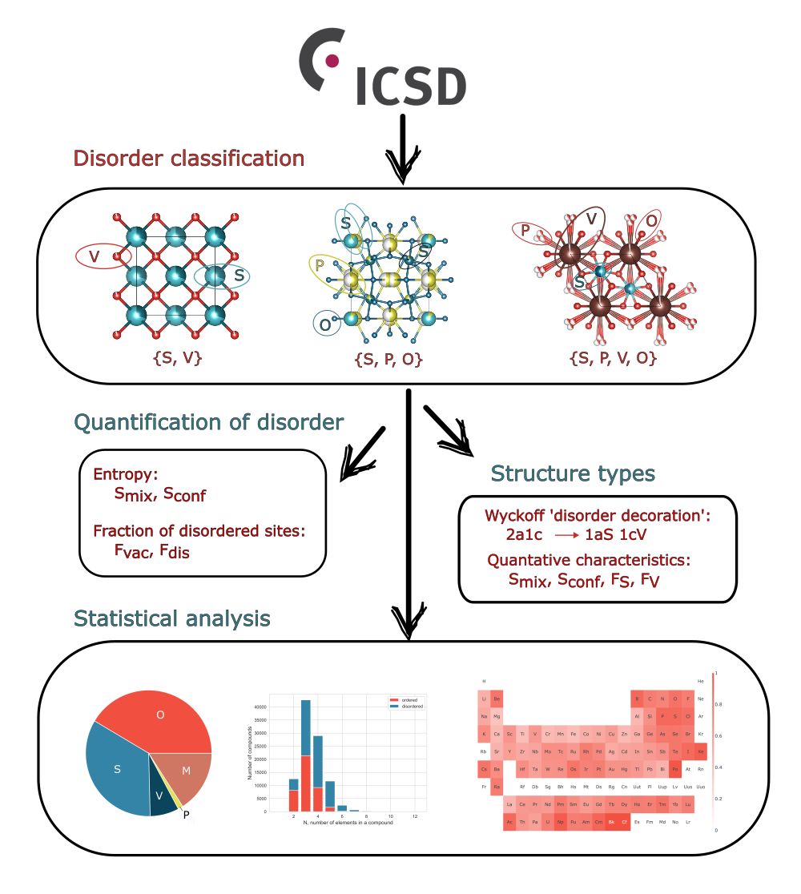

# Disorder: extraction and analysis of distribution of structural disorder in crystalline materials reported in the ICSD

<p align="center">
  
</p>

To use the code:

(1) clone repositiory using your favourite method

(2) create anacoda environment with all nessecary packages:
```
conda env create -f env.yml
```

## This repository contains:
<ul>
      <li>Tools:
      <ul>
        <li> disorder.cifreader.Read_CIF </li>
        <li> disorder.disorder.Disorder </li>
        <li> disorder.entropy.Entropy </li>
      </ul>
      </li>
      <li>Jupyter notebooks/ python scripts:
      <ul>
        <li> disorder_examples.ipynb </li>
        <li> data_extraction.py </li>
        <li> data_extraction_H_compounds.ipynb </li>
        <li> analysis.ipynb </li>
      </ul>
      </li>
      <li>Data files:
      <ul>
        <li> Disorder labels for all compounds [link] </li>
        <li> Disorder Wyckoff sequences, entropies, fractions of disordered sites for all compounds [link] </li>
      </ul>
      </li>
</ul>

### Tools

**disorder.cifreader.Read_CIF**(file: str, occ_tol: float = 1.05): the reader of crystallographic structures from CIFs. The main difference of this tool compared to analogious tool from pymatgen and ASE is that it distinguishes ordered orbits occupied by the same element as different orbits (it makes sence as different orbits represent geometrically different sets of points). For example, in Hg2 Na2 Se6 Sn2 (ICSD col code 013796) there are two orbits occupied by Se: ocupies two orbits 16l, and 8h. Atoms on those two orbits will be assigned different orbit labels by Read_CIF in contrast to pymatgen and ASE readers. 

```
from disorder.cifreader import Read_CIF

file=Read_CIF(file)

formula=file.read_formula
ID=file.read_id
Z=file.z
cell=file.cell
space_group=file.space_group

# Reading all symmetry operations from CIF, output is a list
symmetry_operations=file.symmetry()

# Reading all orbit infromation, output is a dataframe
orbits=file.orbits()

# Generating positions for all atoms, with proper orbit labels.
# Output is whether dataframe, or dataframe and pymatgen Structure object
positions=file.positions(orbits, symmetry_operations, pystruct=False)

```

**disorder.disorder.Disorder**(file, radius_file='data/all_radii.csv'): Disorder class aims to assign disorder labels to each orbit in the structure spacified by the input CIF

```
from disorder.disorder import Disorder

disorder=Disorder(CIF_file, radius_file='data/all_radii.csv')
# making classification
output = disorder.classify()
```

**disorder.disorder.Entropy**(file, radius_file='data/all_radii.csv'): class to calculate mixing and configurational entropy from the input CIF

```
from disorder.entropy import Entropy

entropy=Entropy(CIF_file, radius_file='data/all_radii.csv')
mixing_entropy=entropy.calculate_entropy(entropy_type='mixing')
configurational_entropy=entropy.calculate_entropy(entropy_type='configurational')
mc_configurational_entropy=entropy.calculate_entropy(entropy_type='mc_configurational')
```
Formulas used for entropy calculation can be found in the paper. Mixing and configurational entropies are calculates using analytical formulas. MC_configurational is a monte carlo estimation of configurational entropy. All three values differ from each other only if positional disorder is present. 

### Jupyter notebooks

**disorder_examples.ipynb** : this notebook demonstrates classification of examples from the paper

**data_extraction.py**: the notebook contains a script to extract disorder data from the database of CIFs, compounds containing H are discarded

**data_extraction_H_compounds.ipynb**: the notebook contains a script to extract disorder data from compounds containing H

**analysis.ipynb**:  script allowing to reproduce graphics from the paper

## Acknowledgements

The authors thank the Leverhulme Trust for funding and Dr. Elena Patyukova for her contribution to the work via the Leverhulme Research Centre for Functional Materials Design (RC-2015-036).


